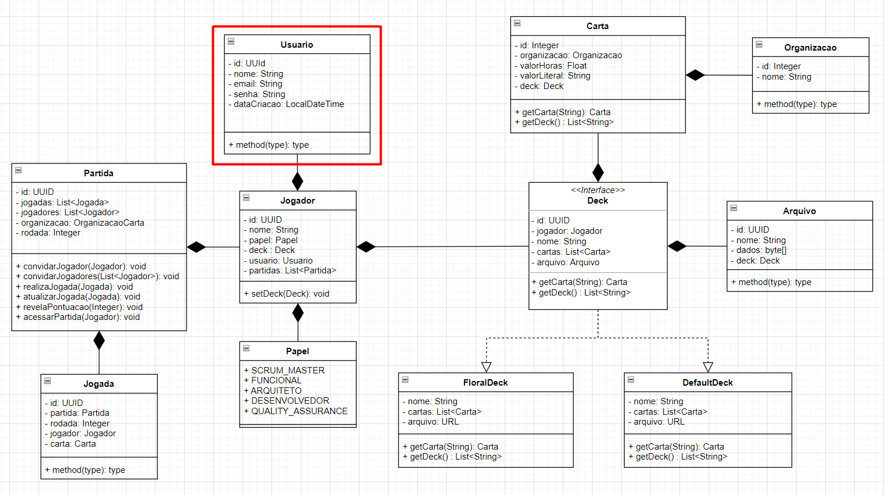

MIT - Engenharia de Software com Java
-
___
<h3>Projeto final da disciplina de Persistencia de Dados</h3>

Este projeto tem como objetivo demonstrar proficiencia na utilização de JDBC, atendendo as seguintes rubricas de forma obrigatória:

1. O aluno utilizou corretamente a arquitetura JDBC?
2. O aluno configurou corretamente os drivers de banco na aplicação?
3. O aluno criou corretamente os statements utilizados nas funcionalidades da aplicação?
4. O aluno preparou a camada de banco com as principais operações?

Os testes das funcionalidades implementadas serão testadas através de classes de testes unitários utilizando o JUnit, e o banco de dados utilizado será 
o Postgres. A classe de testes utilizada para validação é a <u><b>UsuarioDAOTest</b></u>.

Para realizar a criação das tabelas e carga inicial dos dados, executar o seguinte comando: mvn flyway:migrate

O tema escolhido para este trabalho é o mesmo adotado como entrega final da pós graduação: uma api para realização de estimativas baseadas no 
Planning Poker. O diagrama de classes (em elaboração) é o abaixo:

Para o objetivo deste trabalho, será criada a classe Usuario. Para organizar uma partida, o usuário precisa ser registrado no serviço porém os 
jogadores convidados da partida não precisam necessariamente serem registrados.

